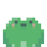
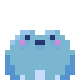
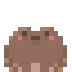
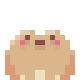
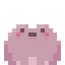
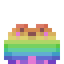

<div align="center">


# Froggy micro-blog

**A tiny frog desktop pet that hops on your screen and nudges you to microblog.** Each entry is saved as a dated Markdown note in the folder of your choice.








*Six colors to choose from, because one frog is never enough.*

</div>

## Quick start

```bash
npm install
npm start
```

That's it! Froggy appears on top of your other windows. Drag it wherever you like and get typing.

> On macOS, grant **Accessibility** access on first launch so the frog can hop on every keystroke. See [macOS permission](#macos-accessibility-permission-for-key-press-hops) below.

Default destination: `~/.froggy/` (changeable in settings).

## Sprite Studio (tweak tool)

A standalone web tool to visually align the spritesheet and design the idle,
hop, and jump animations, then export the values.

```bash
npm run studio
# opens at http://localhost:4321/tools/sprite-studio.html
```

## Project layout

```
src/
  main.js            Electron main process: windows, tray, timers, IPC, note writing
  preload.js         Safe IPC bridge to renderers
  config.js          Loads/saves config.json in userData
  notes.js           Writes each entry as a Markdown file
  pet/               The frog: canvas sprite animation, drag, click-through, gear
  input/             The write-an-entry popup
  settings/          Settings panel
assets/              The 6 frog spritesheets + tray icon
```
